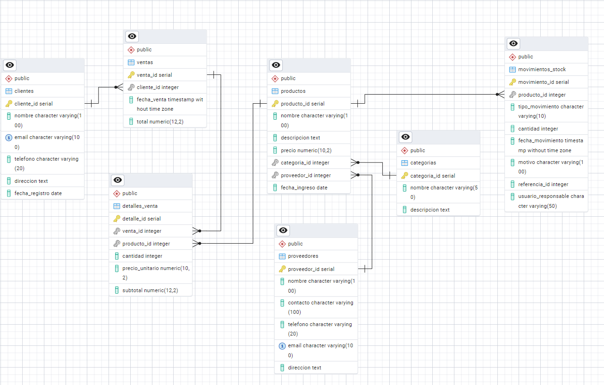

# 📋 Sistema de Gestión de Inventario TechZone

## 📌 Descripción del Proyecto

**TechZone** es un sistema de gestión de inventario diseñado para tiendas de tecnología. Su propósito es brindar una solución eficiente para el control de productos, proveedores, ventas y clientes.

Este sistema permite:

- Controlar el inventario y el stock de productos.  
- Gestionar proveedores y registrar nuevos productos.  
- Registrar ventas asociadas a clientes y empleados.  
- Generar reportes analíticos para la toma de decisiones.  
- Detectar automáticamente errores como stock insuficiente o datos inconsistentes.

## 🔍 Modelo Entidad-Relación



## 🛠 Instrucciones de Instalación

### Requisitos Previos

- PostgreSQL 12 o superior.  
- Acceso a un usuario con privilegios de superusuario.

### Pasos para Ejecutar

```bash
# 1. Crear base de datos
psql -U postgres -c "CREATE DATABASE filtro_techzone;"

# 2. Ejecutar scripts en orden
psql -U postgres -d filtro_techzone -f db.sql
psql -U postgres -d filtro_techzone -f insert.sql
psql -U postgres -d filtro_techzone -f ProcedureAndFunctions.sql
```

## 📂 Descripción de Archivos

| Archivo                     | Descripción                                                                 |
|----------------------------|-----------------------------------------------------------------------------|
| `db.sql`                   | Crea la estructura de la base de datos (tablas, relaciones, índices).       |
| `insert.sql`               | Inserta datos iniciales: clientes, productos, proveedores y empleados.      |
| `queries.sql`              | Contiene 6 consultas analíticas útiles para el análisis de ventas y stock.  |
| `ProcedureAndFunctions.sql`| Crea un procedimiento almacenado que valida stock y registra ventas.        |

## 💻 Uso del Sistema

### Registrar una Venta

```sql
CALL registrar_venta(
    1,                     -- ID del cliente
    ARRAY[1, 5, 7],        -- IDs de productos comprados
    ARRAY[1, 2, 1],        -- Cantidades correspondientes
    'vendedor1'            -- Usuario que realiza la venta
);
```

### Casos de Error

```sql
CALL registrar_venta(999, ARRAY[1], ARRAY[1], 'vendedor1'); -- Cliente inexistente
CALL registrar_venta(1, ARRAY[999], ARRAY[1], 'vendedor1'); -- Producto inexistente
CALL registrar_venta(1, ARRAY[1], ARRAY[999], 'vendedor1'); -- Stock insuficiente
```

## 📊 Consultas Analíticas

Para ejecutar las consultas:

```sql
\i queries.sql
```

Consultas incluidas:

1. Productos con stock crítico (menos de 5 unidades)  
2. Ventas por mes específico  
3. Cliente más frecuente  
4. Top 5 productos más vendidos  
5. Ventas por rangos de fechas  
6. Clientes inactivos (más de 6 meses sin comprar)

### Ejemplo individual

```sql
SELECT * FROM productos WHERE calcular_stock(producto_id) < 5;
```

## 🚨 Manejo de Errores

El sistema informa automáticamente mediante mensajes cuando ocurren:

- Clientes o productos inexistentes  
- Stock insuficiente  
- Inconsistencias en los datos  
- Errores durante transacciones

## 📁 Estructura del Repositorio

```
.
├── db.sql
├── insert.sql
├── queries.sql
├── ProcedureAndFunctions.sql
├── modelo_er.png
└── README.md
```
```
